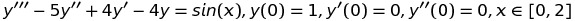
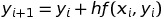
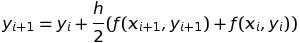
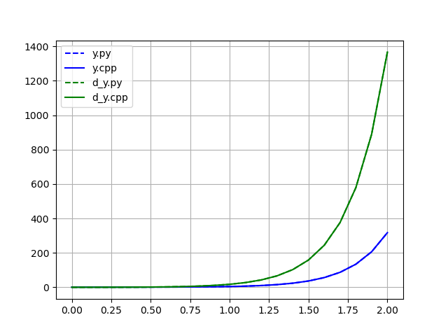
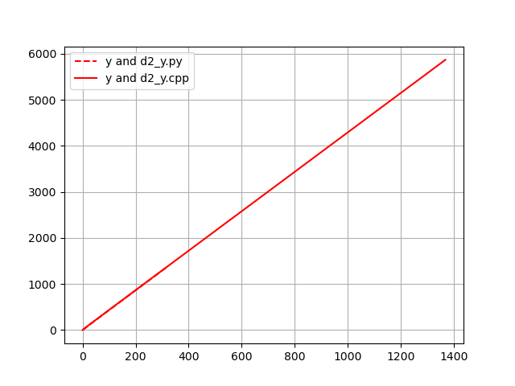
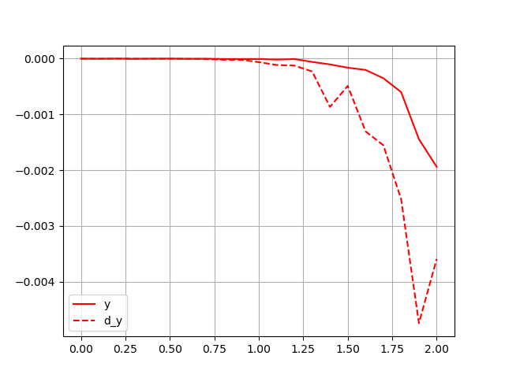

# Лабораторная работа № 7. Задача Коши.
Выполнил студент группы 426
Болдырев Иван Сергеевич

# Вариант №8
Решить неявным методом Адамса при k = 1 задачу Коши

с заданной относительной точностью 0,01.

# Теоретическая часть
Явный метод Адамса:

Неявный метод Адамса:

# Практическая часть
## Структура программы
Функия dif_ur() возвращает значение правой части уравнения.
В main() задается начальный шаг h, находится значение x[i+1], по явному методу дамся находится приближенное значение для y'', y', y, затем это значение используется в неявном методе. В цикле do-while находится новое значение шага h, с удовлетворением погрешности.
## Результат:
Графики y(x) и y'(x)

График фазовых траекторий

Разностные графики

Пунктиром обозначены данные полученные с помощью встроенных функций, обычной линией - методом Адамса.

## Основной метод в lab7.cpp. Программа из файла lab7.py реализует решение задачи Коши с помощью встроенных функций и сопоставление графиков.
